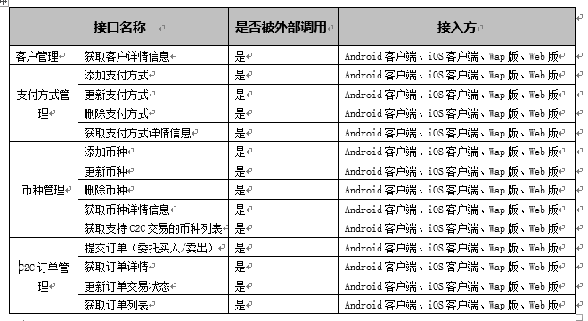
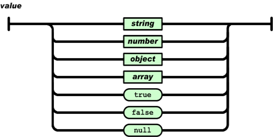

LDS交易所C2C接口规范 
=================

[概述]  本文主要介绍LDS交易所C2C的接口规范。(https://github.com/bovinphang/Blockchain/)


​                                         作    者：         bovin.phang@qq.com           

​                                         完成日期：            2018/10/18                  

​                                          签 收 人：                                       

​                                          签收日期：                                       


| 版本号    | 修改批准人 | 修改人   | 起止日期       | 备注     | 签收人  |
| ------ | ----- | ----- | ---------- | ------ | ---- |
| 1.0    |       | bovin | 10/15/2018 | 创建当前文档 |      |
| latest |       | bovin | 10/18/2018 |        |      |
|        |       |       |            |        |      |


目录
---------------

**[1 序言](#1-preface)**
* [1.1 背景](#11-background)
* [1.2 编写目的](#12-purpose-of-writing)
* [1.3 术语与缩略词](#13-terms-and-abbreviations)
* [1.4 对象及范围](#14-object-and-scope)
* [1.5 参考资料](#15-reference-material)

**[2. 接口总体概述](#2-overview-of-the-interface)**
* [2.1 协议概述](#21-protocol-overview)
* [2.2 接口设计规则](#22-interface-design-rules)
* [2.3 协议数据格式](#23-protocol-data-format)
* [2.4 请求规则](#24-request-rule)
* [2.5 应答规则](#25-response-rule)
* [2.6 命名及指令规则](#26-naming-and-instruction-rules)
  * [2.6.1  _apiname命名规则](#261-apiname-naming-rules)

**[3. 接入方](#3-user)**

**[4. 接口](#4-interface)**
* [4.1 客户管理](#41-user-management)
  * [4.1.1 获取客户详情信息](#411-get-user-info-by-id)
     * [4.1.1.1 功能说明](#4111-function-description)
     * [4.1.1.2 输入](#4112-input)
     * [4.1.1.3 输出](#4113-ouput)
* [4.2 支付方式管理](#42-payment-management)
  * [4.2.1 添加支付方式](#421-add-payment)
     * [4.2.1.1 功能说明](#4211-function-description)
     * [4.2.1.2 输入](#4212-input)
     * [4.2.1.3 输出](#4213-ouput)
  * [4.2.2 更新支付方式](#422-update-payment)
     * [4.2.2.1 功能说明](#4221-function-description)
     * [4.2.2.2 输入](#4222-input)
     * [4.2.2.3 输出](#4223-ouput)
  * [4.2.3 删除支付方式](#423-del-payment)
     * [4.2.3.1 功能说明](#4231-function-description)
     * [4.2.3.2 输入](#4232-input)
     * [4.2.3.3 输出](#4233-ouput)
  * [4.2.4 获取支付方式详情信息](#424-get-payment-info-by-id)
     * [4.2.4.1 功能说明](#4241-function-description)
     * [4.2.4.2 输入](#4242-input)
     * [4.2.4.3 输出](#4243-ouput)
  * [4.2.5 获取支付方式列表](#425-get-payment-list)
     * [4.2.5.1 功能说明](#4251-function-description)
     * [4.2.5.2 输入](#4252-input)
     * [4.2.5.3 输出](#4253-ouput)
* [4.3 钱包管理](#43-wallet-management)
  * [4.3.1 获取客户资产信息](#431-get-user-assets)
     * [4.3.1.1 功能说明](#4311-function-description)
     * [4.3.1.2 输入](#4312-input)
     * [4.3.1.3 输出](#4313-ouput)
* [4.4 币种管理](#44-coin-management)
  * [4.4.1 获取币种详情信息](#441-get-coin-info-by-id)
     * [4.4.1.1 功能说明](#4411-function-description)
     * [4.4.1.2 输入](#4412-input)
     * [4.4.1.3 输出](#4413-ouput)
  * [4.4.2 获取支持C2C交易的币种列表](#442-get-c2c-coin-list)
     * [4.4.2.1 功能说明](#4421-function-description)
     * [4.4.2.2 输入](#4422-input)
     * [4.4.2.3 输出](#4423-ouput)
* [4.5 C2C订单管理](#45-c2c-order-management)
  * [4.5.1 提交订单（委托买入/卖出）](#451-add-order)
     * [4.5.1.1 功能说明](#4511-function-description)
     * [4.5.1.2 输入](#4512-input)
     * [4.5.1.3 输出](#4513-ouput)
  * [4.5.2 获取订单详情](#452-get-order-info)
     * [4.5.2.1 功能说明](#4521-function-description)
     * [4.5.2.2 输入](#4522-input)
     * [4.5.2.3 输出](#4523-ouput)
  * [4.5.3 更新订单交易状态](#453-update-order-status)
     * [4.5.3.1 功能说明](#4531-function-description)
     * [4.5.3.2 输入](#4532-input)
     * [4.5.3.3 输出](#4533-ouput)
  * [4.5.4 获取订单列表](#454-get-order-list)
     * [4.5.4.1 功能说明](#4541-function-description)
     * [4.5.4.2 输入](#4542-input)
     * [4.5.4.3 输出](#4543-ouput)

**[5. 附录](#5-appendix)**

* [5.1 接口全局返回说明](#51-interface-global-return-description)
* [5.2 业务错误码](#52-error-code)
* [5.3 JSON简介](#53-json-introduction)
  * [5.3.1 JSON的结构](#531-json-structure)
  * [5.3.2 JSON具有的形式](#532-json-shape)


# <a name='1-preface'>1. 序言</a>

## <a name='11-background'>1.1 背景</a>

## <a name='12-purpose-of-writing'>1.2 编写目的</a>

## <a name='13-terms-and-abbreviations'>1.3 术语与缩略词</a>

| 名词    | 说明                                       |
| ----- | ---------------------------------------- |
| UIN   | User internal Number                     |
| Sid   | Session ID                               |
| UTF-8 | UCS Transformation Format-8bit, UTF-8就是以8位为单元对UCS进行编码。 |
| URL   | Uniform Resource Locator                 |
| WWW   | World Wide Web                           |
| HTTP  | HyperText Transfer Protocol, 超文本传输协议     |
| XML   | Extensible Markup Language,可扩展标记语言       |
| JSON  | JavaScript Object Notation,一种轻量级的数据交换格式  |
| AJAX  | Asynchronous JavaScript and XML          |


## <a name='14-object-and-scope'>1.4 对象及范围</a>

- 开发人员、维护人员、策划人员、测试人员


## <a name='15-reference-material'>1.5 参考资料</a> 

《LDS交易所C2C需求v2.0.doc》


# <a name='2-overview-of-the-interface'>2. 接口总体概述</a>

## <a name='21-protocol-overview'>2.1 协议概述</a>

​       本规范定义LDS交易所C2C项目接口层通信规范。接口采用基于HTTP+POST/JSON协议与后端接口层进行通信。按照协议规范将封装好的JSON数据报文，通过HTTP的方式POST到接口层，接口层解析JSON参数，以JSON的格式返回对应的数据。

## <a name='22-interface-design-rules'>2.2 接口设计规则</a>

​       考虑Web端展现形式的灵活变化以及各业务的复杂性，为提高数据交互的效率，Web端接口设计遵循以下规则：
-  接口的纯净性：一个接口原则下只完成一个功能，不与其它功能耦合。提高接口可复用性和灵活性。
-  最大化减小数据的大小：优化数据结构，只返回对本操作有用的数据。减少网络传输流量。返回使用JSON格式数据代替XML。
-  支持任意接口顺序调用：在灵活调用与客户端效率中取得平衡。

## <a name='23-protocol-data-format'>2.3 协议数据格式</a>

返回的数据格式采用标准的JSON格式：

```json
{
  "code": "200",
  "msg": "success",
  "time": "1539667689",
  "data": {
  	"name": "nnh",
    "list": [
      {
        "name": "demo",
        "photo": "photo_url"
      },
      {
      	 "name": "demo1",
         "photo": "photo_url1"
      }
     ],
    "user": {
        "id": "1",
        "name": "nnh1111",
        "sex": "男"
     }
  }
}
```

## <a name='24-request-rule'>2.4 请求规则</a>

​       本规范基于应用层协议HTTP来实现，后端接口层采用PHP语言来实现，前端使用AJax的方式实现。
​       请求格式:  URL+JSON/POST(JSON使用UTF-8编码)
​       请求参数由以下两部分组成：

1. URL部分：

|    参数    | 说明                                       | 是否必传 |
| :------: | :--------------------------------------- | :--: |
| _apiname | 后端调用接口名                                  |  是   |
|  mtoken  | 用户登录令牌=md5(用户ID+"_"+当前时间的Unix 时间戳+"_"+ 10000到99999之间的随机整数);用户登录后，后台会返回mtoken给前端，前端保存该令牌，和用户相关的操作都需要改令牌进行登录校验 |  是   |
|  cc和ck   | cc=当前时间的Unix 时间戳；ck=md5(当前时间的Unix 时间戳+私钥+ apiname)，用于校验请求的合法性以及防止重复性请求 |  是   |
|   _env   | App环境参数 {"_v":"A1.0.0\| I1.0.0",app版本,A开头表示Android端,I开头表示ios端,"_lon":"经度","_lat":"纬度","_network":"手机网络""_model":"手机型号"如:iphone7s} |  是   |
|  其他业务参数  |                                          |  否   |

2. POST 数据BODY部分： 
- 无：此情况Content-Type必须为空或者"application/x-www-form-urlencoded"

- 上传文件： Content-Type 为" multipart/form-data"

  ​

  根据_apiname的值不同，用户需要组装不同的JSON数据包。JSON数据包统一使用UTF-8的编码进行传输。HTTP请求的 Content-Type 为"application/json;charset=utf-8"。


## <a name='25-response-rule'>2.5 应答规则</a>

接口层处理数据后，将以JSON格式返回。关于JSON的更多介绍，请参考附录(JSON简介)
HTTP返回的 Content-Type 应该设置为：application/json;charset=utf-8。
接口层返回的JSON数据至少包含一个元素即code，表示操作是否成功，如下示：

```json
{"code": "200"}
```
返回的其它数据统一放到data属性中,如下所示：
```json
{"code":"200","msg":"success","time": "1539667689","data":  "123"}
```
如果返回的数据含有多个参数的对象，按下面的格式返回：
```json
{"code":"200","msg":"success","time": "1539667689","data":{"id": "12","name": "test"}}
```
如果返回的数据为一数组，按下面的格式返回：
```json
{"code":"200","msg":"success","time": "1539667689","data": ["1","2"]}
```


## <a name='26-naming-and-instruction-rules'>2.6 命名及指令规则</a>

### <a name='261-apiname-naming-rules'>2.6.1  _apiname命名规则</a>

按模块/控制器/操作划分, 以点号”.” 分割, 格式为：
`moduleName.controllerName.methodName`
_apiname的值对大小不敏感。


# <a name='3-user'>3. 接入方</a>

 

# <a name='4-interface'>4. 接口</a>


## <a name='41-user-management'>4.1 客户管理</a>

### <a name='411-get-user-info-by-id'>4.1.1  获取客户详情信息</a>

#### <a name='4111-function-description'>4.1.1.1  功能说明</a>
通过客户ID获取其详情信息。

#### <a name='4112-input'>4.1.1.2  输入</a>

**Request URL:**

```http
http://IP:PORT/?_apiname=user.user.getUserInfoById&mtoken=e856f9453a657db361881aebd78351af&cc=1539659992&ck=b7d7662bd8771012810857e2b9656bf5&_env={}
```

**Request Method:** `POST`

**Accept:** `application/json`

**Request Body:**

```json
{"id":"3"}
```

 **请求参数说明：**

- URL部分

| 参数     | 类型   | 是否必填 | 最大长度 | 描述                                          |
| -------- | ------ | -------- | -------- | --------------------------------------------- |
| _apiname | String | 是       | 32       | 接口名，固定值：user.user.getUserInfoById     |
| mtoken   | String | 是       | 32       | 用户登录令牌,由后台生成返回给前端             |
| cc       | Int    | 是       | 10       | 时间戳，调用方生成                            |
| ck       | String | 是       | 32       | 校验码，调用方生成: md5(时间戳+私钥+ apiname) |
| _env     | String | 否       | 200      | App环境参数                                   |

-  Body部分


| 参数 | 类型 | 是否必填 | 最大长度 | 描述 |
| -------- | ---- | ------- | ---- | ------ |
| id  | int | 是 | 11  | 客户ID |

#### <a name='4113-ouput'>4.1.1.3  输出</a>

```json
{
  "code": "200",
  "msg": "success",
  "time": "1539667765",
  "data": {
    "mobile_phone": "13241386259",
    "realname": "张龙",
    "nickname": "龙龙",
    "sex": "1",
    "headerpic": "ald/2018-07-25/1532504421urky2034.jpeg",
    "email": "zhanglong@163.com",
    "borndate": "1980-01-01",
    "area": "北京-北京市-东城区",
    "address": ""
  }
}

```

**响应参数说明**

| 参数         | 类型    | 最大长度 | 描述                     |
| ------------ | ------- | -------- | ------------------------ |
| mobile_phone | string  | 13       | 手机号                   |
| realname     | string  | 50       | 真实姓名                 |
| nickname     | string  | 50       | 昵称                     |
| sex          | tinyint | 1        | 性别 1：男，2：女        |
| headerpic    | string  | 150      | 头像                     |
| email        | string  | 100      | 邮箱地址                 |
| borndate     | date    | 0        | 出生日期(格式1900-01-01) |
| area         | string  | 100      | 所在地区                 |
| address      | string  | 200      | 地址                     |

## <a name='42-payment-management'>4.2 支付方式管理</a>

### <a name='421-add-payment'>4.2.1  添加支付方式</a>

#### <a name='4211-function-description'>4.2.1.1  功能说明</a>
添加支付方式。

#### <a name='4212-input'>4.2.1.2  输入</a>

**Request URL:**

```http
http://IP:PORT/?_apiname=user.payment.addPayment&mtoken=e856f9453a657db361881aebd78351af&cc=1539659992&ck=b7d7662bd8771012810857e2b9656bf5&_env={}
```

**Request Method:** `POST`

**Accept:** `application/json`

**Request Body:**

银行卡：

```json
{
  "type":"1",
  "account_number":"622866402148754396",
  "account_name":"张龙",
  "bank_name":"建设银行",
  "bank_address":"深圳市车公庙支行"
}
```
支付宝：
```json
{
  "type":"2",
  "account_number":"15665544556",
  "qrcode":"http://domain/images/alipay/qrcode/15665544556.png"
}
```

微信：
```json
{
  "type":"3",
  "account_number":"15665544556",
  "qrcode":"http://domain/images/alipay/qrcode/15665544556.png"
}
```
 **请求参数说明：**

- URL部分

| 参数     | 类型   | 是否必填 | 最大长度 | 描述                                          |
| -------- | ------ | -------- | -------- | --------------------------------------------- |
| _apiname | String | 是       | 32       | 接口名，固定值：user.payment.addPayment       |
| mtoken   | String | 是       | 32       | 用户登录令牌,由后台生成返回给前端             |
| cc       | Int    | 是       | 10       | 时间戳，调用方生成                            |
| ck       | String | 是       | 32       | 校验码，调用方生成: md5(时间戳+私钥+ apiname) |
| _env     | String | 否       | 200      | App环境参数                                   |

-  Body部分

银行卡：

| 参数 | 类型 | 是否必填 | 最大长度 | 描述 |
| -------- | ---- | ------- | ---- | ------ |
| type | tinyint | 是 | 1 | 支付方式类型 （1：银行卡， 2：支付宝 ，3：微信支付） |
| account_number | string | 是 | 20    | 银行卡帐号               |
| account_name   | string | 是 | 50  | 开户名                   |
| bank_name      | string | 是 | 50  | 开户支行                 |
| bank_address   | string | 是 | 100 | 开户支行所在地址         |

支付宝或微信：

| 参数 | 类型 | 是否必填 | 最大长度 | 描述 |
| -------- | ---- | ------- | ---- | ------ |
| account_number | string | 是 | 20    | 支付宝/微信支付帐号       |
| qrcode         | string | 是 | 100 | 支付宝/微信支付收款二维码 |

#### <a name='4213-ouput'>4.2.1.3  输出</a>


```json
{
  "code": "200",
  "msg": "success",
  "time": "1539667765",
  "data": {
    "id":"10"
  }
}

```

**响应参数说明**

| 参数       | 类型   | 最大长度 | 描述                   |
| -------------- | ------ | ----- | ------------------------ |
| id | int | 11    | 支付方式帐户ID              |


### <a name='422-update-payment'>4.2.2  更新支付方式</a>

#### <a name='4221-function-description'>4.2.2.1  功能说明</a>
更新支付方式。

#### <a name='4222-input'>4.2.2.2  输入</a>

**Request URL:**

```http
http://IP:PORT/?_apiname=user.payment.updatePayment&mtoken=e856f9453a657db361881aebd78351af&cc=1539659992&ck=b7d7662bd8771012810857e2b9656bf5&_env={}
```

**Request Method:** `POST`

**Accept:** `application/json`

**Request Body:**

银行卡：

```json
{
  "type":"1",
  "id":"3",
  "account_number":"622866402148754396",
  "account_name":"张龙",
  "bank_name":"建设银行",
  "bank_address":"深圳市车公庙支行"
}
```
支付宝：
```json
{
  "type":"2",
  "id":"3",
  "account_number":"15665544556",
  "qrcode":"http://domain/images/alipay/qrcode/15665544556.png"
}
```

微信：
```json
{
  "type":"3",
  "id":"3",
  "account_number":"15665544556",
  "qrcode":"http://domain/images/alipay/qrcode/15665544556.png"
}
```

 **请求参数说明：**

- URL部分

| 参数     | 类型   | 是否必填 | 最大长度 | 描述                                          |
| -------- | ------ | -------- | -------- | --------------------------------------------- |
| _apiname | String | 是       | 32       | 接口名，固定值：user.payment.updatePayment    |
| mtoken   | String | 是       | 32       | 用户登录令牌,由后台生成返回给前端             |
| cc       | Int    | 是       | 10       | 时间戳，调用方生成                            |
| ck       | String | 是       | 32       | 校验码，调用方生成: md5(时间戳+私钥+ apiname) |
| _env     | String | 否       | 200      | App环境参数                                   |

-  Body部分

银行卡：

| 参数 | 类型 | 是否必填 | 最大长度 | 描述 |
| -------- | ---- | ------- | ---- | ------ |
| type | tinyint | 是 | 1 | 支付方式类型 （1：银行卡， 2：支付宝 ，3：微信支付） |
| id  | int | 是 | 11  | 支付方式帐户ID |
| account_number | string | 是 | 20    | 银行卡帐号               |
| account_name   | string | 是 | 50  | 开户名                   |
| bank_name      | string | 是 | 50  | 开户支行                 |
| bank_address   | string | 是 | 100 | 开户支行所在地址         |

支付宝或微信：

| 参数 | 类型 | 是否必填 | 最大长度 | 描述 |
| -------- | ---- | ------- | ---- | ------ |
| type | tinyint | 是 | 1 | 支付方式类型 （1：银行卡， 2：支付宝 ，3：微信支付） |
| id  | int | 是 | 11  | 支付方式帐户ID |
| account_number | string | 是 | 20    | 支付宝/微信支付帐号       |
| qrcode         | string | 是 | 100 | 支付宝/微信支付收款二维码 |

#### <a name='4223-ouput'>4.2.2.3  输出</a>


```json
{
  "code": "200",
  "msg": "success",
  "time": "1539667765",
  "data": {
    "type":"1",
    "id":"10"
  }
}

```

**响应参数说明**

| 参数       | 类型   | 最大长度 | 描述                   |
| -------------- | ------ | ----- | ------------------------ |
| type | tinyint | 1 | 支付方式类型 （1：银行卡， 2：支付宝 ，3：微信支付） |
| id | int | 11    | 支付方式帐户ID              |


### <a name='423-del-payment'>4.2.3  删除支付方式</a>

#### <a name='4231-function-description'>4.2.3.1  功能说明</a>
通过支付方式的帐户ID获取其详情信息。

#### <a name='4232-input'>4.2.3.2  输入</a>

**Request URL:**

```http
http://IP:PORT/?_apiname=user.payment.delPayment&mtoken=e856f9453a657db361881aebd78351af&cc=1539659992&ck=b7d7662bd8771012810857e2b9656bf5&_env={}
```

**Request Method:** `POST`

**Accept:** `application/json`

**Request Body:**

```json
{"type":"1","id":"3"}
```

 **请求参数说明：**

- URL部分

| 参数     | 类型   | 是否必填 | 最大长度 | 描述                                          |
| -------- | ------ | -------- | -------- | --------------------------------------------- |
| _apiname | String | 是       | 32       | 接口名，固定值：user.payment.delPayment       |
| mtoken   | String | 是       | 32       | 用户登录令牌,由后台生成返回给前端             |
| cc       | Int    | 是       | 10       | 时间戳，调用方生成                            |
| ck       | String | 是       | 32       | 校验码，调用方生成: md5(时间戳+私钥+ apiname) |
| _env     | String | 否       | 200      | App环境参数                                   |

-  Body部分


| 参数 | 类型 | 是否必填 | 最大长度 | 描述 |
| -------- | ---- | ------- | ---- | ------ |
| type | tinyint | 是 | 1 | 支付方式类型 （1：银行卡， 2：支付宝 ，3：微信支付） |
| id  | int | 是 | 11  | 支付方式帐户ID |

#### <a name='4233-ouput'>4.2.3.3  输出</a>

```json
{
  "code": "200",
  "msg": "success",
  "time": "1539667765",
  "data": {
    "type":"1",
    "id":"10"
  }
}

```

**响应参数说明**

| 参数       | 类型   | 最大长度 | 描述                    |
| -------------- | ------ | ----- | ------------------------- |
| type | tinyint | 1 | 支付方式类型 （1：银行卡， 2：支付宝 ，3：微信支付） |
| id | int | 11    | 支付方式帐户ID              |

### <a name='424-get-payment-info-by-id'>4.2.4  获取支付方式详情信息</a>

#### <a name='4241-function-description'>4.2.4.1  功能说明</a>
通过支付方式的帐户ID获取其详情信息。

#### <a name='4242-input'>4.2.4.2  输入</a>

**Request URL:**

```http
http://IP:PORT/?_apiname=user.payment.getPaymentInfoById&mtoken=e856f9453a657db361881aebd78351af&cc=1539659992&ck=b7d7662bd8771012810857e2b9656bf5&_env={}
```

**Request Method:** `POST`

**Accept:** `application/json`

**Request Body:**

```json
{"type":"1","id":"3"}
```

 **请求参数说明：**

- URL部分

| 参数     | 类型   | 是否必填 | 最大长度 | 描述                                            |
| -------- | ------ | -------- | -------- | ----------------------------------------------- |
| _apiname | String | 是       | 32       | 接口名，固定值：user.payment.getPaymentInfoById |
| mtoken   | String | 是       | 32       | 用户登录令牌,由后台生成返回给前端               |
| cc       | Int    | 是       | 10       | 时间戳，调用方生成                              |
| ck       | String | 是       | 32       | 校验码，调用方生成: md5(时间戳+私钥+ apiname)   |
| _env     | String | 否       | 200      | App环境参数                                     |

-  Body部分


| 参数 | 类型 | 是否必填 | 最大长度 | 描述 |
| -------- | ---- | ------- | ---- | ------ |
| type | tinyint | 是 | 1 | 支付方式类型 （1：银行卡， 2：支付宝 ，3：微信支付） |
| id  | int | 是 | 11  | 支付方式帐户ID |

#### <a name='4243-ouput'>4.2.4.3  输出</a>

银行卡：

```json
{
  "code": "200",
  "msg": "success",
  "time": "1539667765",
  "data": {
    "account_number":"622866402148754396",
    "account_name":"张龙",
    "bank_name":"建设银行",
    "bank_address":"深圳市车公庙支行"
  }
}

```

**响应参数说明**

| 参数           | 类型   | 最大长度 | 描述             |
| -------------- | ------ | -------- | ---------------- |
| account_number | string | 20       | 银行卡帐号       |
| account_name   | string | 50       | 开户名           |
| bank_name      | string | 50       | 开户支行         |
| bank_address   | string | 100      | 开户支行所在地址 |

支付宝或微信：
```json
{
  "code": "200",
  "msg": "success",
  "time": "1539667765",
  "data": {
    "account_number":"15665544556",
    "qrcode":"http://domain/images/alipay/qrcode/15665544556.png"
  }
}

```

**响应参数说明**

| 参数           | 类型   | 最大长度 | 描述                      |
| -------------- | ------ | -------- | ------------------------- |
| account_number | string | 20       | 支付宝/微信支付帐号       |
| qrcode         | string | 100      | 支付宝/微信支付收款二维码 |

### <a name='425-get-payment-list'>4.2.5  获取支付方式列表</a>

#### <a name='4251-function-description'>4.2.5.1  功能说明</a>
通过个人所有支付方式列表。

#### <a name='4252-input'>4.2.5.2  输入</a>

**Request URL:**

```http
http://IP:PORT/?_apiname=user.payment.getPaymentList&mtoken=e856f9453a657db361881aebd78351af&cc=1539659992&ck=b7d7662bd8771012810857e2b9656bf5&_env={}
```

**Request Method:** `POST`

**Accept:** `application/json`

**Request Body:**

空。

 **请求参数说明：**

- URL部分

| 参数     | 类型   | 是否必填 | 最大长度 | 描述                                          |
| -------- | ------ | -------- | -------- | --------------------------------------------- |
| _apiname | String | 是       | 32       | 接口名，固定值：user.payment.getPaymentList   |
| mtoken   | String | 是       | 32       | 用户登录令牌,由后台生成返回给前端             |
| cc       | Int    | 是       | 10       | 时间戳，调用方生成                            |
| ck       | String | 是       | 32       | 校验码，调用方生成: md5(时间戳+私钥+ apiname) |
| _env     | String | 否       | 200      | App环境参数                                   |


#### <a name='4253-ouput'>4.2.5.3  输出</a>

```json
{
  "code": "200",
  "msg": "success",
  "time": "1539667765",
  "data": {
    "bank_cards":[
      {
        "account_number":"622866402148754396",
        "account_name":"张龙",
        "bank_name":"建设银行",
        "bank_address":"深圳市车公庙支行"
      },
      {
        "account_number":"621792076063967955",
        "account_name":"李琳",
        "bank_name":"招商银行",
        "bank_address":"深圳市高新园支行"
      }
    ],
    "alipay":[
      {
    	"account_number":"13654478454",
    	"qrcode":"http://domain/images/alipay/qrcode/ac56ds5543d.png"
      }
    ],
    "wxpay":[
      {
    	"account_number":"13654478454",
    	"qrcode":"http://domain/images/wxpay/qrcode/b5tw9c4h3f6.png"
      }
    ]
  }
}

```

**响应参数说明**

| 参数       | 类型   | 最大长度 | 描述                   |
| -------------- | ------ | ----- | ------------------------ |
| bank_cards     | String | 10   | 银行卡帐户列表结果集 |
| alipay     | String | 10   | 支付宝列表结果集 |
| wxpay     | String | 10   | 微信支付列表结果集 |

| 参数           | 类型   | 最大长度 | 描述             |
| -------------- | ------ | -------- | ---------------- |
| account_number | string | 20       | 银行卡帐号       |
| account_name   | string | 50       | 开户名           |
| bank_name      | string | 50       | 开户支行         |
| bank_address   | string | 100      | 开户支行所在地址 |


| 参数           | 类型   | 最大长度 | 描述                      |
| -------------- | ------ | -------- | ------------------------- |
| account_number | string | 20       | 支付宝/微信支付帐号       |
| qrcode         | string | 100      | 支付宝/微信支付收款二维码 |


## <a name='43-wallet-management'>4.3 钱包管理</a>

### <a name='431-get-user-assets'>4.3.1  获取客户资产信息</a>

#### <a name='4311-function-description'>4.3.1.1  功能说明</a>
通过客户ID获取其资产详情信息。

#### <a name='4312-input'>4.3.1.2  输入</a>

**Request URL:**

```http
http://IP:PORT/?_apiname=wallet.wallet.getUserAssets&mtoken=e856f9453a657db361881aebd78351af&cc=1539659992&ck=b7d7662bd8771012810857e2b9656bf5&_env={}
```

**Request Method:** `POST`

**Accept:** `application/json`

**Request Body:**


 **请求参数说明：**

- URL部分

| 参数     | 类型   | 是否必填 | 最大长度 | 描述                                          |
| -------- | ------ | -------- | -------- | --------------------------------------------- |
| _apiname | String | 是       | 32       | 接口名，固定值：wallet.wallet.getUserAssets   |
| mtoken   | String | 是       | 32       | 用户登录令牌,由后台生成返回给前端             |
| cc       | Int    | 是       | 10       | 时间戳，调用方生成                            |
| ck       | String | 是       | 32       | 校验码，调用方生成: md5(时间戳+私钥+ apiname) |
| _env     | String | 否       | 200      | App环境参数                                   |


#### <a name='4313-ouput'>4.3.1.3  输出</a>

```json
{
  "code": "200",
  "msg": "success",
  "time": "1539667765",
  "data": {
    "available_balance": "158535.42328589",
    "freeze_balance": "75829.27561772",
    "delay_balance": "0.00000000"
  }
}

```

**响应参数说明**

| 参数              | 类型    | 最大长度 | 描述                                 |
| ----------------- | ------- | -------- | -------------------- |
| available_balance | decimal | 20,8     | 可用余额              |
| freeze_balance    | decimal | 20,8     | 冻结余额              |
| delay_balance     | decimal | 20,8     | 延迟余额（后台转账、扣款、注册分润） |


## <a name='44-coin-management'>4.4 币种管理</a>

### <a name='441-get-coin-info-by-id'>4.4.1  获取币种详情信息</a>

#### <a name='4411-function-description'>4.4.1.1  功能说明</a>
通过币种ID获取币种详情信息。

#### <a name='4412-input'>4.4.1.2  输入</a>

**Request URL:**

```http
http://IP:PORT/?_apiname=coin.coin.getCoinInfoById&mtoken=e856f9453a657db361881aebd78351af&cc=1539659992&ck=b7d7662bd8771012810857e2b9656bf5&_env={}
```

**Request Method:** `POST`

**Accept:** `application/json`

**Request Body:**

```json
{"coin_id":"4724740975629413"}
```

 **请求参数说明：**

- URL部分

| 参数     | 类型   | 是否必填 | 最大长度 | 描述                                          |
| -------- | ------ | -------- | -------- | --------------------------------------------- |
| _apiname | String | 是       | 32       | 接口名，固定值：coin.coin.getCoinInfoById     |
| mtoken   | String | 是       | 32       | 用户登录令牌,由后台生成返回给前端|
| cc       | Int    | 是       | 10       | 时间戳，调用方生成             |
| ck       | String | 是       | 32       | 校验码，调用方生成: md5(时间戳+私钥+ apiname) |
| _env     | String | 否       | 200      | App环境参数              |

-  Body部分


| 参数    | 类型    | 是否必填 | 最大长度 | 描述   |
| ------- | ------- | -------- | -------- | ------ |
| coin_id | tinyint | 是       | 3        | 币种ID |

#### <a name='4413-ouput'>4.4.1.3  输出</a>

```json
{
  "code": "200",
  "msg": "success",
  "time": "1539667765",
  "data": {
    "coin_id": "3",
    "coinname": "USDT",
    "coinname_ch": "USDT",
    "coinname_abb": "USDT",
    "descr": "USDT （tether.to）是一个由著名交易所bitfinex发起和由全球多家交易所支持的USD电子代币。USDT是基于比特币网络上的一个资产代币（Omnilayer协议），按照银行实际持有的法币量进行发行，市场价值与美元按照1:1锚定。用户可以像使用比特币一样在区块链上进行发送和接收。要将USDT兑换为真实美元，需要在完成实名认证(KYC)的情况下将USDT发送到支持USDT充值和美元提现的交易所进行兑换。亦可以通过c2c交易与CNY进行兑换。",
    "buying_amount": "0.00000000",
    "selling_amount": "0.00000000",
    "buying_price": "0.00000000",
    "selling_price": "0.00000000",
  }
}

```

**响应参数说明**

| 参数           | 类型    | 最大长度 | 描述            |
| -------------- | ------- | -------- | --------------- |
| coin_id        | tinyint | 3        | 币种ID          |
| coinname       | varchar | 200      | 币种名称        |
| coinname_ch    | varchar | 200      | 币种名称-中文   |
| coinname_abb   | varchar | 60       | 币种简称        |
| descr          | text    | 0        | 币种描述        |
| buying_amount  | decimal | 20       | C2C最低买入金额 |
| selling_amount | decimal | 20       | C2C最低卖出金额 |
| buying_price   | decimal | 20       | 买入单价        |
| selling_price  | decimal | 20       | 卖出单价        |


### <a name='442-get-c2c-coin-list'>4.4.2  获取支持C2C交易的币种列表</a>

#### <a name='4421-function-description'>4.4.2.1  功能说明</a>
获取币种列表信息。

#### <a name='4422-input'>4.4.2.2  输入</a>

**Request URL:**

```http
http://IP:PORT/?_apiname=coin.coin.getC2CCoinList&mtoken=e856f9453a657db361881aebd78351af&cc=1539659992&ck=b7d7662bd8771012810857e2b9656bf5&_env={}
```

**Request Method:** `POST`

**Accept:** `application/json`

**Request Body:**

```json
{"is_c2c":"1"}
```

 **请求参数说明：**

- URL部分

| 参数     | 是否必填 | 类型   | 最大长度 | 描述                                          |
| -------- | -------- | ------ | -------- | --------------------------------------------- |
| _apiname | String | 是       | 32       | 接口名，固定值：coin.coin.getC2CCoinList     |
| mtoken   | String | 是       | 32       | 用户登录令牌,由后台生成返回给前端|
| cc       | Int    | 是       | 10       | 时间戳，调用方生成             |
| ck       | String | 是       | 32       | 校验码，调用方生成: md5(时间戳+私钥+ apiname) |
| _env     | String | 否       | 200      | App环境参数              |

-  Body部分

| 参数   | 类型 | 是否必填    | 最大长度 | 描述                                |
| ------ | -------- | ------- | -------- | ----------------------------------- |
| is_c2c | tinyint       | 是 | 1        | 是否支持C2C交易  0：不支持，1：支持 |

#### <a name='4423-ouput'>4.4.2.3  输出</a>

```json
{
  "code": "200",
  "msg": "success",
  "time": "1539667765",
  "data": {
    "list": [
      {
        "coin_id": "1",
        "coinname": "LDS",
        "coinname_ch": "LDS",
        "coinname_abb": "LDS",
        "buying_amount": "0.00000000",
        "selling_amount": "0.00000000",
        "buying_price": "0.00000000",
        "selling_price": "0.00000000"
      },
      {
        "coin_id": "2",
        "coinname": "BTC",
        "coinname_ch": "BTC",
        "coinname_abb": "BTC",
        "buying_amount": "0.00000000",
        "selling_amount": "0.00000000",
        "buying_price": "0.00000000",
        "selling_price": "0.00000000"
      },
      {
        "coin_id": "3",
        "coinname": "USDT",
        "coinname_ch": "USDT",
        "coinname_abb": "USDT",
        "buying_amount": "0.00000000",
        "selling_amount": "0.00000000",
        "buying_price": "0.00000000",
        "selling_price": "0.00000000"
      }
    ]
  }
}
```

**响应参数说明**

| 参数 | 类型   | 最大长度 | 描述       |
| ---- | ------ | -------- | ---------- |
| list | String | 100      | 列表结果集 |

## <a name='45-c2c-order-management'>4.5 C2C订单管理</a>

### <a name='451-add-order'>4.5.1 提交订单（委托买入/卖出）</a>

#### <a name='4511-function-description'>4.5.1.1  功能说明</a>
提交委托买入/卖出相关的订单数据。

#### <a name='4512-input'>4.5.1.2  输入</a>

**Request URL:**

```http
http://IP:PORT/?_apiname=order.order.addOrder&mtoken=e856f9453a657db361881aebd78351af&cc=1539659992&ck=b7d7662bd8771012810857e2b9656bf5&_env={}
```

**Request Method:** `POST`

**Accept:** `application/json`

**Request Body:**

```json
{"coin_id":"1","volume":"10000","type":"1"}
```

 **请求参数说明：**

- URL部分

| 参数     | 是否必填 | 类型   | 最大长度 | 描述                                          |
| -------- | -------- | ------ | -------- | --------------------------------------------- |
| _apiname | String | 是       | 32       | 接口名，固定值：coin.coin.addOrder     |
| mtoken   | String | 是       | 32       | 用户登录令牌,由后台生成返回给前端|
| cc       | Int    | 是       | 10       | 时间戳，调用方生成             |
| ck       | String | 是       | 32       | 校验码，调用方生成: md5(时间戳+私钥+ apiname) |
| _env     | String | 否       | 200      | App环境参数              |

-  Body部分

| 参数    | 类型 | 是否必填   | 最大长度 | 描述                           |
| ------- | -------- | ------- | -------- | ------------------------------ |
| coin_id | tinyint       | 是 | 3        | 币种ID                         |
| volume  | float       | 是   | 13       | 买入/卖出数量                  |
| type    | tinyint       | 是 | 1        | 类型  1：委托买入，2：委托卖出 |


#### <a name='4513-ouput'>4.5.1.3  输出</a>

```json
{
  "code": "200",
  "msg": "success",
  "time": "1539667765",
  "data": {
    "order_no":"c20181018999"
  }
}
```

**响应参数说明**

| 参数 | 类型   | 最大长度 | 描述     |
| -------- | ------ | ---- | ---------- |
| order_no | String | 20| 订单号   |

### <a name='452-get-order-info'>4.5.2 获取订单详情</a>

#### <a name='4521-function-description'>4.5.2.1  功能说明</a>
根据订单号获取订单详情数据。

#### <a name='4522-input'>4.5.2.2  输入</a>

**Request URL:**

```http
http://IP:PORT/?_apiname=order.order.getOrderInfo&mtoken=e856f9453a657db361881aebd78351af&cc=1539659992&ck=b7d7662bd8771012810857e2b9656bf5&_env={}
```

**Request Method:** `POST`

**Accept:** `application/json`

**Request Body:**

```json
{"order_no":"c20181018999"}
```

 **请求参数说明：**

- URL部分

| 参数     | 是否必填 | 类型   | 最大长度 | 描述                                          |
| -------- | -------- | ------ | -------- | --------------------------------------------- |
| _apiname | String | 是       | 32       | 接口名，固定值：coin.coin.getOrderInfo     |
| mtoken   | String | 是       | 32       | 用户登录令牌,由后台生成返回给前端|
| cc       | Int    | 是       | 10       | 时间戳，调用方生成             |
| ck       | String | 是       | 32       | 校验码，调用方生成: md5(时间戳+私钥+ apiname) |
| _env     | String | 否       | 200      | App环境参数              |

-  Body部分

| 参数   | 类型 | 是否必填  | 最大长度 | 描述                         |
| ---------- | ---- | ----- | ---- | ------------------------------ |
| order_no | string   | 是 | 20 | 订单号 |


#### <a name='4523-ouput'>4.5.2.3  输出</a>

```json
{
  "code": "200",
  "msg": "success",
  "time": "1539667765",
  "data": {
    "order_no":"c20181018999",
    "coin_id": "10",
    "price": "10.00",
    "volume": "1000",
    "total_price": "10000.00",
    "buyer_id": "101",
    "seller_id": "1002",
    "payment_method": "1",
    "buyer_payment_account": "20010",
    "seller_payment_account": "51135",
    "status":"0",
    "create_time": "2018-07-25 14:38:22",
    "update_time": "2018-07-26 14:38:22",
    "end_time": "2018-07-28 14:38:22",
    "close_time": ""
  }
}
```

**响应参数说明**

| 参数 | 类型   | 最大长度 | 描述     |
| -------- | ------ | ---- | ---------- |
| order_no | string | 20   | 订单号  |
| coin_id | tinyint | 3 | 币种ID |
| price   | decimal | 20  | 成交单价     |
| volume | int | 11  | 成交数量 |
| total_price | decimal | 20 | 成交总价 |
| reference_no | string | 32 | 参考号 |
| buyer_id | int | 11 | 买方ID |
| seller_id | int | 11 | 卖方ID |
| payment_method | tinyint | 1 | 交易支付方式（1：银行卡， 2：支付宝 ，3：微信支付） |
| buyer_payment_account | int | 11 | 买方交易帐户ID |
| seller_payment_account | int | 11 | 卖方交易帐户ID                                               |
| status   | tinyint | 1    | 订单状态（0：待付款， 1：已付款，2：交易成功， 3：交易关闭） |
| create_time | datetime | 0 | 订单创建时间 |
| update_time | datetime | 0 | 订单更新时间 |
| end_time | datetime | 0 | 交易完成时间 |
| close_time | datetime | 0 | 交易关闭时间 |


### <a name='453-update-order-status'>4.5.3 更新订单交易状态</a>

#### <a name='4521-function-description'>4.5.3.1  功能说明</a>
更新订单的交易状态。

#### <a name='4522-input'>4.5.3.2  输入</a>

**Request URL:**

```http
http://IP:PORT/?_apiname=order.order.updateOrderStatus&mtoken=e856f9453a657db361881aebd78351af&cc=1539659992&ck=b7d7662bd8771012810857e2b9656bf5&_env={}
```

**Request Method:** `POST`

**Accept:** `application/json`

**Request Body:**

```json
{"order_no":"c20181018999","status":"1"}
```

 **请求参数说明：**

- URL部分

| 参数     | 是否必填 | 类型   | 最大长度 | 描述                                          |
| -------- | -------- | ------ | -------- | ------------------- |
| _apiname | String | 是       | 32       | 接口名，固定值：coin.coin.updateOrderStatus     |
| mtoken   | String | 是       | 32       | 用户登录令牌,由后台生成返回给前端|
| cc       | Int    | 是       | 10       | 时间戳，调用方生成             |
| ck       | String | 是       | 32       | 校验码，调用方生成: md5(时间戳+私钥+ apiname) |
| _env     | String | 否       | 200      | App环境参数              |

-  Body部分

| 参数     | 是否必填 | 类型    | 最大长度 | 描述                                                         |
| -------- | -------- | ------- | -------- | ------------------------- |
| order_no | string   | 是  | 20       | 订单号                                                       |
| status   | tinyint   | 是 | 1        | 订单状态（0：待付款， 1：已付款， 2：交易成功 ，3：交易完成， 4：交易关闭） |


#### <a name='4523-ouput'>4.5.3.3  输出</a>

```json
{
  "code": "200",
  "msg": "success",
  "time": "1539667765",
  "data": {}
  }
}
```


### <a name='454-get-order-list'>4.5.4 获取订单列表</a>

#### <a name='4541-function-description'>4.5.4.1  功能说明</a>
获取订单列表数据。

#### <a name='4542-input'>4.5.4.2  输入</a>

**Request URL:**

```http
http://IP:PORT/?_apiname=order.order.getOrderList&mtoken=e856f9453a657db361881aebd78351af&cc=1539659992&ck=b7d7662bd8771012810857e2b9656bf5&_env={}
```

**Request Method:** `POST`

**Accept:** `application/json`

**Request Body:**

```json
{"type":"1","current_page": "5","page_size":"20"}
```

 **请求参数说明：**

- URL部分

| 参数     | 是否必填 | 类型   | 最大长度 | 描述                                          |
| -------- | -------- | ------ | -------- | --------------------------------------------- |
| _apiname | String | 是       | 32       | 接口名，固定值：coin.coin.getOrderList     |
| mtoken   | String | 是       | 32       | 用户登录令牌,由后台生成返回给前端|
| cc       | Int    | 是       | 10       | 时间戳，调用方生成             |
| ck       | String | 是       | 32       | 校验码，调用方生成: md5(时间戳+私钥+ apiname) |
| _env     | String | 否       | 200      | App环境参数              |

-  Body部分

| 参数   | 是否必填 | 类型  | 最大长度 | 描述                         |
| ---------- | ---- | ----- | ---- | ------------------------------ |
| type | tinyint  | 是 | 1 | 交易数据类型（1：当前交易，2：历史交易） |
| current_page | int | 否 | 11 | 当前页，默认为：1 |
| page_size | int | 否 | 11 | 每页显示记录数，默认为：20条 |


#### <a name='4543-ouput'>4.5.4.3  输出</a>

```json
{
  "code": "200",
  "msg": "success",
  "time": "1539667765",
  "data": {
    "total_page": "11",
    "total_record": "218",
    "list": [
      {
        "order_no":"c20181018900",
        "price": "10.00",
        "volume": "1000",
        "total_price": "10000.00",
        "buyer_id": "3",
        "seller_id": "1002",
        "payment_method": "1",
        "buyer_payment_account": "20010",
        "seller_payment_account": "51135",
        "status":"0",
        "create_time": "2018-07-21 14:38:22",
        "update_time": "2018-07-22 14:38:22",
        "end_time": "2018-07-24 14:38:22",
        "close_time": ""
      },
      {
        "order_no":"c20181018901",
        "price": "12.00",
        "volume": "2000",
        "total_price": "9000.00",
        "buyer_id": "101",
        "seller_id": "3",
        "payment_method": "1",
        "buyer_payment_account": "22315",
        "seller_payment_account": "20010",
        "status":"1",
        "create_time": "2018-07-25 14:38:22",
        "update_time": "2018-07-26 14:38:22",
        "end_time": "2018-07-28 14:38:22",
        "close_time": ""
      },
      {
        "order_no":"c20181018998",
        "price": "11.50",
        "volume": "4000",
        "total_price": "8000.00",
        "buyer_id": "3",
        "seller_id": "1043",
        "payment_method": "1",
        "buyer_payment_account": "20010",
        "seller_payment_account": "51136",
        "status":"0",
        "create_time": "2018-06-12 14:38:22",
        "update_time": "2018-06-16 14:38:22",
        "end_time": "2018-06-18 14:38:22",
        "close_time": ""
      }
    ]
  }
}
```

**响应参数说明**

| 参数 | 类型   | 最大长度 | 描述     |
| -------- | ------ | ---- | ---------- |
| total_page     | int | 11  | 总页数 |
| total_record     | int | 11  | 总记录数 |
| list     | string | 1024 | 列表结果集 |
| order_no | string | 20   | 订单号  |
| coin_id | tinyint | 3 | 币种ID |
| price   | decimal | 20  | 成交单价     |
| volume | int | 11  | 成交数量 |
| total_price | decimal | 20 | 成交总价 |
| reference_no | string | 32 | 参考号 |
| buyer_id | int | 11 | 买方ID |
| seller_id | int | 11 | 卖方ID |
| payment_method | tinyint | 1 | 交易支付方式（1：银行卡， 2：支付宝 ，3：微信支付） |
| buyer_payment_account | int | 11 | 买方交易帐户ID |
| seller_payment_account | int | 11 | 卖方交易帐户ID                                               |
| status   | tinyint | 1    | 订单状态（0：待付款， 1：已付款，2：交易成功， 3：交易关闭） |
| create_time | datetime | 0 | 订单创建时间 |
| update_time | datetime | 0 | 订单更新时间 |
| end_time | datetime | 0 | 交易完成时间 |
| close_time | datetime | 0 | 交易关闭时间 |


# <a name='5-appendix'>5. 附录</a>

## <a name='51-interface-global-return-description'>5.1 接口全局返回说明</a>

接口以json格式返回，并且内容都是以字符串格式返回：

```json
{
    "code": "200",
    "msg":"success",
    "data":{
        "name":"nnh",
        "list":[
            {"name":"demo","photo":"photo_url"},  {"name":"demo1","photo":"photo_url1"}
        ],
        "user":{"id":"1","name":"nnh1111","sex":"男"}
	}
}
```

返回说明：

| **返回key** | 描述                                                         |
| ----------- | ------------------------------------------------------------ |
| code        | 响应状态码   200 成功   104 用户未登录   400 操作有误   其他返回码表示不同的操作场景 |
| msg         | 请求成功或失败时的message                                    |
| time        | 服务端时间戳，单位：毫秒。用于同步时间                       |
| data        | 数据实体                                                     |


## <a name='52-error-code'>5.2 业务错误码</a>

| 错误码 | 错误描述                                       |
| ------ | --------------------------------------------------- |
| 104   |   用户未登录         |
| 304   |   已存在         |
| 400   |   操作有误         |
| 404   |   参数有误         |
| 405   |   您今天手机获取的验证码已达到上限         |
| 408   |   请求无效         |
| 998   |   升级中，入口暂时关闭         |
| 999   |   请升级版本         |
| 1000   |   记录不存在         |
| 1001   |   无操作权限         |
| 1002   |   用户被禁用         |
| 1003   |   请求数据有误         |
| 1004   |   请求数据范围有误         |
| 1005   |   用户已绑定         |
| 1006   |   无法分享该角色，入口已关闭         |
| 1007   |   您已经有一个很优秀的上级了，快去分享培养下级吧！         |
| 1008   |   拥有下级后不能再建立上级推荐人，快去分享培养下级吧！         |
| 1009   |   自己不能推荐自己哦，快去分享培养下级吧！         |
| 2001   |   短信发送失败         |
| 2002   |   用户不存在         |
| 2003   |   登录密码不正确         |
| 2004   |   密码输入不正确         |
| 2005   |   您已设置登录密码         |
| 3001   |   收益金额有误         |
| 3002   |   商品折扣过高         |
| 3004   |   折扣过高或折扣过低         |
| 3011   |   商品类型不正确         |
| 5001   |   分类id不能为空         |
| 5002   |   商品id不能为空         |
| 5003   |   搜索内容不能为空         |
| 5005   |   商品信息不存在         |
| 5006   |   商品已下架         |
| 5007   |   购物车无商品         |
| 5008   |   您不能修改购物车商品         |
| 5009   |   商品规格不存在         |
| 5010   |   购物车无商品         |
| 5011   |   添加错误!         |
| 5012   |   评论内容超出字数！         |
| 5013   |   收货地址不存在         |
| 5014   |   收货人信息不一致         |
| 5015   |   没有可以选择的规格         |
| 5016   |   请填写收货人的身份信息         |
| 5017   |   收货人身份信息已存在         |
| 6001   |   库存不足         |
| 6002   |   支付成功         |
| 6003   |   支付有误         |
| 6004   |   商品限购一件         |
| 6010   |   已达到限购数量上限，活动期间不能购买         |
| 6011   |   重复提交         |
| 6012   |   已超过限购数量上限         |
| 6013   |   活动结束，无法提交订单         |
| 7001   |   不能取消订单         |
| 7002   |   不能确认收货         |
| 7003   |   收货时间只能延长一次         |
| 7005   |   订单在剩余7天内方可延长收货         |
| 7006   |   一天内只能提醒发货3次         |
| 7007   |   提交订单有误         |
| 7008   |   您当前的版本无法购买海外商品，请下载最新的APP！         |
| 8001   |   网络加载失败         |
| 8002   |   商家平台号错误，请重新输入正确的平台号！         |
| 8003   |   请填写正确的消费金额！         |
| 8004   |   投诉失败         |
| 8005   |   不参与活动金额不得大于总金额的50%         |
| 8006   |   网络加载失败         |
| 8007   |   网络加载失败         |
| 8008   |   提交失败         |
| 8009   |   非法用户         |
| 8010   |   非法商家         |
| 8011   |   实体店信息不存在         |
| 8012   |   管理员信息不存在         |
| 8013   |   分享人不存在         |
| 9900   |   您当前的版本无法识别，请下载最新的APP进行扫描！         |
| 10001   |   不能与原密码一致         |
| 10002   |   数据已存在         |
| 10003   |   数据未存在         |
| 10040   |   填写的金额太低         |
| 10041   |   请填写金额         |
| 11001   |   退单处理中，请勿重复提交         |
| 11002   |   申请已取消，请勿重复提交         |
| 11003   |   退款已成功，不可取消         |
| 11004   |   已经审核，不可重复提交         |
| 11005   |   已经确认，不可重复提交         |
| 12001   |   已是最新快递信息         |
| 12002   |   已填写退货快递，无法重复提交         |
| 20001   |   用户角色已存在         |
| 20002   |   您已推荐该用户         |
| 20003   |   身份证号码错误         |
| 20004   |   短信验证码已过期         |
| 20005   |   短信验证码错误         |
| 20006   |   手机号码不正确         |
| 20007   |   请选择正确的时间段         |
| 20008   |   代理已经存在         |
| 20009   |   负责人身份证错误         |
| 20010   |   法人身份证错误         |
| 20011   |   手机号码已存在         |
| 20012   |   银行卡号码不正确         |
| 20013   |   银行卡号已经被使用         |
| 20014   |   该身份证号码已被推荐         |
| 20015   |   二维码有误         |
| 20016   |   银行卡格式不正确         |
| 20017   |   无对应银行信息         |
| 20018   |   银行信息有误         |
| 20019   |   银行卡号和户名不符         |
| 20020   |   银行信息错误次数过多，请稍候再试         |
| 20021   |   身份证信息有误         |
| 20022   |   身份证信息和姓名不符         |
| 20023   |   身份证信息错误次数过多，请稍后再试         |
| 20024   |   请输入短信验证码         |
| 20101   |   无法切换到该角色         |
| 20102   |   角色范围不正确         |
| 20103   |   用户信息不存在         |
| 20104   |   您已达到推荐牛商上限，请申请成为牛创客         |
| 20105   |   您已达到推荐牛掌柜上限，请申请成为牛创客         |
| 20106   |   您已绑定实体店         |
| 20107   |   步骤不正确         |
| 20108   |   数据已提交，无法修改         |
| 20109   |   手机号码已经有母店，无法重复添加         |
| 20201   |   手机号码重复         |
| 20301   |   用户非实体店         |
| 20302   |   该用户已被其它用户分享         |
| 20303   |   分享人无对应角色，无法分享         |
| 21001   |   请切换牛商 牛掌柜查看企业账户         |
| 22000   |   请填写该帐号的手机号码         |
| 23000   |   无法添加vip牛店进门店         |
| 26001   |   实名认证错误         |
| 26002   |   您已实名认证了         |
| 26003   |   请先进行实名认证         |
| 26004   |   您已开通个人信用         |
| 26005   |   请输入帐号         |
| 27001   |   不能选择未来时间         |
| 30001   |   余额不足         |
| 30002   |   余额扣减失败         |
| 30003   |   收入操作失败         |
| 30004   |   支付失败         |
| 30005   |   已支付         |
| 40001   |   订单已支付         |
| 40002   |   订单有误         |
| 40003   |   订单已删除         |
| 40004   |   订单已失效         |
| 40005   |   版本过低，不能提交订单，请升级         |
| 50000   |   支付密码错误次数过多，请重新设置         |
| 50001   |   请设置支付密码         |
| 50002   |   支付密码不正确         |
| 50003   |   支付密码错误次数过多         |
| 50004   |   商家平台号已存在         |
| 50005   |   商家平台号已被使用         |
| 50006   |   无效的商家平台号         |
| 60000   |   错误次数过多，请15分钟以后再试         |
| 60001   |   卡号有误         |
| 60002   |   分类下存在商品信息不能删除         |
| 60003   |   商品名称不能为空         |
| 60004   |   商品主图不能为空         |
| 60005   |   商品价格错误         |
| 60006   |   商品单位不能为空         |
| 60007   |   推荐商品不能超过6个         |
| 60008   |   禁止操作         |
| 60009   |   收藏或取消收藏的信息不存在         |
| 60010   |   不能重复收藏该信息         |
| 60011   |   没有收藏过该信息         |
| 60012   |   不存在的收藏类型         |
| 60013   |   该条评论已回复         |
| 60014   |   评论信息不存在         |
| 60015   |   金额不正确         |
| 60016   |   购物车商品数量错误         |
| 60017   |   商品信息错误         |
| 60018   |   购物车信息不存在         |
| 60019   |   商家已同意退款或已退款成功         |
| 60020   |   无效的订单状态         |
| 60021   |   退款订单已关闭         |
| 60022   |   该店铺已经休息了         |
| 60023   |   订单已关闭         |
| 60024   |   商家拒绝接单         |
| 60025   |   订单已取消         |
| 60026   |   商家已接单         |
| 60027   |   买家未付款         |
| 60028   |   订单已完结         |
| 60029   |   已消费订单才能删除         |
| 60030   |   退款中订单才拒绝         |
| 60031   |   商家已同意退款         |
| 60032   |   商家已拒绝退款         |
| 60033   |   该订单已退款         |
| 60034   |   订单已申请退款，不能接单         |
| 60035   |   订单已申请退款，不能配送         |
| 60036   |   订单不能删除         |
| 60037   |   订单已备菜         |
| 60038   |   您当前的版本不支持下单，请下载最新的版本！         |
| 60040   |   超出C2C最低买入金额                       |
| 60041   |   交易金额过大，无经销商接单                |
| 70001   |   员工姓名不能重复         |
| 70002   |   该员工已添加         |
| 70003   |   员工信息不存在         |
| 70005   |   服务员号不存在         |
| 70006   |   服务员号不属于当前商家         |
| 70007   |   当前用户已有绑定服务员         |
| 70008   |   奖励金额错误，请重新提交         |
| 70009   |   自己无法绑定自己         |
| 70010   |   折扣金额错误         |
| 80001   |   账号已绑定1         |
| 80002   |   账号已绑定2         |
| 80003   |   账号已绑定3         |
| 80004   |   账号已绑定4         |
| 90001   |   价格异常无法操作         |
| 90002   |   操作异常         |
| 90003   |   重复提交         |
| 90004   |   获取价格异常         |
| 90005   |   UID不能为空         |
| 90006   |   每个UID用户购买旅游产品限额66000元         |


## <a name='53-json-introduction'>5.3 JSON简介</a>

### <a name='531-json-structure'>5.3.1 JSON的结构</a>

​        JSON(JavaScript Object Notation) 是一种轻量级的数据交换格式。 易于人阅读和编写。同时也易于机器解析和生成。 它基于JavaScript Programming Language，Standard ECMA-262 3rd Edition - December 1999的一个子集。 

​        JSON采用完全独立于语言的文本格式，但是也使用了类似于C语言家族的习惯（包括C, C++, C#, PHP,Java, JavaScript, Perl, Python等）。 这些特性使JSON成为理想的数据交换语言。

-   “名称/值”对的集合（A collection of name/value pairs）。不同的语言中，它被理解为*对象（object）*、纪录（record）、结构（struct）、字典（dictionary）、哈希表（hash table），有键列表（keyed list）或者关联数组 （associative array）。 

-  值的有序列表（An ordered list of values）。在大部分语言中，它被理解为数组（array）。

​        这些都是常见的数据结构。事实上大部分现代计算机语言都以某种形式支持它们。这使得一种数据格式在同样基于这些结构的编程语言之间交换成为可能。

### <a name='532-json-shape'>5.3.2  JSON具有的形式</a>

- 对象是一个无序的“‘名称/值”对集合。一个对象以“{”（左括号）开始，“}”（右括号）结束。每个“名称”后跟一个“:”（冒号）；“名称/值” 对之间使用“,”（逗号）分隔。


- 数组是值（value）的有序集合。一个数组以“[”（左中括号）开始，“]”（右中括号）结束。值之间使用“,”（逗号）分隔。


- 值（*value*）可以是双引号括起来的字符串（*string*）、数值(number)、1、0、 null、对象（object）或者数组（array）。这些结构可以嵌套。 



- 字符串（*string*）是由双引号包围的任意数量Unicode字符的集合，使用反斜线转义。一个字符（character）即一个单独的字符串（character string）。 字符串（*string*）与C或者Java的字符串非常相似。 


- 数值（*number*）也与C或者Java的数值非常相似。除去未曾使用的八进制与十六进制格式。除去一些编码细节。