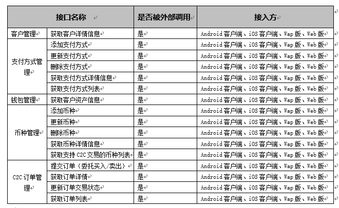

LDS交易所C2C接口规范 
=================

[概述]  本文主要介绍LDS交易所C2C的接口规范。(https://github.com/bovinphang/Blockchain/)


​                                         作    者：         bovin.phang@qq.com           

​                                         完成日期：            2018/10/18                  

​                                          签 收 人：                                       

​                                          签收日期：                                       


| 版本号    | 修改批准人 | 修改人   | 起止日期       | 备注     | 签收人  |
| ------ | ----- | ----- | ---------- | ------ | ---- |
| 1.0    |       | bovin | 10/15/2018 | 创建当前文档 |      |
| latest |       | bovin | 10/18/2018 |        |      |
|        |       |       |            |        |      |


目录
---------------

**[1 序言](#1-preface)**
* [1.1 背景](#11-background)
* [1.2 编写目的](#12-purpose-of-writing)
* [1.3 术语与缩略词](#13-terms-and-abbreviations)
* [1.4 对象及范围](#14-object-and-scope)
* [1.5 参考资料](#15-reference-material)

**[2. 接口总体概述](#2-overview-of-the-interface)**
* [2.1 协议概述](#21-protocol-overview)
* [2.2 接口设计规则](#22-interface-design-rules)
* [2.3 协议数据格式](#23-protocol-data-format)
* [2.4 请求规则](#24-request-rule)
* [2.5 应答规则](#25-response-rule)
* [2.6 命名及指令规则](#26-naming-and-instruction-rules)
  * [2.6.1  _apiname命名规则](#261-apiname-naming-rules)

**[3. 接入方](#3-user)**

**[4. 接口](#4-interface)**
* [4.1 客户管理](#41-user-management)
  * [4.1.1 获取客户详情信息](#411-get-user-info-by-id)
     * [4.1.1.1 功能说明](#4111-function-description)
     * [4.1.1.2 输入](#4112-input)
     * [4.1.1.3 输出](#4113-ouput)
* [4.2 支付方式管理](#42-payment-management)
  * [4.2.1 获取支付方式详情信息](#421-get-payment-info-by-id)
     * [4.2.1.1 功能说明](#4211-function-description)
     * [4.2.1.2 输入](#4212-input)
     * [4.2.1.3 输出](#4213-ouput)
* [4.3 币种管理](#43-coin-management)
  * [4.3.1 获取币种详情信息](#431-get-coin-info-by-id)
     * [4.3.1.1 功能说明](#4311-function-description)
     * [4.3.1.2 输入](#4312-input)
     * [4.3.1.3 输出](#4313-ouput)
  * [4.3.2 获取支持C2C交易的币种列表](#432-get-c2c-coin-list)
     * [4.3.2.1 功能说明](#4321-function-description)
     * [4.3.2.2 输入](#4322-input)
     * [4.3.2.3 输出](#4323-ouput)
* [4.4 C2C订单管理](#44-c2c-order-management)
  * [4.4.1 提交订单（委托买入/卖出）](#441-add-order)
     * [4.4.1.1 功能说明](#4411-function-description)
     * [4.4.1.2 输入](#4412-input)
     * [4.4.1.3 输出](#4413-ouput)
  * [4.4.2 获取订单详情](#442-get-order-info)
     * [4.4.2.1 功能说明](#4421-function-description)
     * [4.4.2.2 输入](#4422-input)
     * [4.4.2.3 输出](#4423-ouput)
  * [4.4.3 更新订单交易状态](#443-update-order-status)
     * [4.4.3.1 功能说明](#4431-function-description)
     * [4.4.3.2 输入](#4432-input)
     * [4.4.3.3 输出](#4433-ouput)

**[5. 附录](#5-appendix)**

* [5.1 接口全局返回说明](#51-interface-global-return-description)
* [5.2 错误码对应信息](#52-error-code)
* [5.3 JSON简介](#53-json-introduction)
  * [5.3.1 JSON的结构](#531-json-structure)
  * [5.3.2 JSON具有的形式](#532-json-shape)


# <a name='1-preface'>1. 序言</a>

## <a name='11-background'>1.1 背景</a>

## <a name='12-purpose-of-writing'>1.2 编写目的</a>

## <a name='13-terms-and-abbreviations'>1.3 术语与缩略词</a>

| 名词    | 说明                                       |
| ----- | ---------------------------------------- |
| UIN   | User internal Number                     |
| Sid   | Session ID                               |
| UTF-8 | UCS Transformation Format-8bit, UTF-8就是以8位为单元对UCS进行编码。 |
| URL   | Uniform Resource Locator                 |
| WWW   | World Wide Web                           |
| HTTP  | HyperText Transfer Protocol, 超文本传输协议     |
| XML   | Extensible Markup Language,可扩展标记语言       |
| JSON  | JavaScript Object Notation,一种轻量级的数据交换格式  |
| AJAX  | Asynchronous JavaScript and XML          |


## <a name='14-object-and-scope'>1.4 对象及范围</a>

- 开发人员、维护人员、策划人员、测试人员


## <a name='15-reference-material'>1.5 参考资料</a> 

《LDS交易所C2C需求v2.0.doc》


# <a name='2-overview-of-the-interface'>2. 接口总体概述</a>

## <a name='21-protocol-overview'>2.1 协议概述</a>

​       本规范定义LDS交易所C2C项目接口层通信规范。接口采用基于HTTP+POST/JSON协议与后端接口层进行通信。按照协议规范将封装好的JSON数据报文，通过HTTP的方式POST到接口层，接口层解析JSON参数，以JSON的格式返回对应的数据。

## <a name='22-interface-design-rules'>2.2 接口设计规则</a>

​       考虑Web端展现形式的灵活变化以及各业务的复杂性，为提高数据交互的效率，Web端接口设计遵循以下规则：
-  接口的纯净性：一个接口原则下只完成一个功能，不与其它功能耦合。提高接口可复用性和灵活性。
-  最大化减小数据的大小：优化数据结构，只返回对本操作有用的数据。减少网络传输流量。返回使用JSON格式数据代替XML。
-  支持任意接口顺序调用：在灵活调用与客户端效率中取得平衡。

## <a name='23-protocol-data-format'>2.3 协议数据格式</a>

返回的数据格式采用标准的JSON格式：

```json
{
  "code": "200",
  "msg": "success",
  "time": "1539667689",
  "data": {
  	"name": "nnh",
    "list": [
      {
        "name": "demo",
        "photo": "photo_url"
      },
      {
      	 "name": "demo1",
         "photo": "photo_url1"
      }
     ],
    "user": {
        "id": "1",
        "name": "nnh1111",
        "sex": "男"
     }
  }
}
```

## <a name='24-request-rule'>2.4 请求规则</a>

​       本规范基于应用层协议HTTP来实现，后端接口层采用PHP语言来实现，前端使用AJax的方式实现。
​       请求格式:  URL+JSON/POST(JSON使用UTF-8编码)
​       请求参数由以下两部分组成：

1. URL部分：

|    参数    | 说明                                       | 是否必传 |
| :------: | :--------------------------------------- | :--: |
| _apiname | 后端调用接口名                                  |  是   |
|  mtoken  | 用户登录令牌=md5(用户ID+"_"+当前时间的Unix 时间戳+"_"+ 10000到99999之间的随机整数);用户登录后，后台会返回mtoken给前端，前端保存该令牌，和用户相关的操作都需要改令牌进行登录校验 |  是   |
|  cc和ck   | cc=当前时间的Unix 时间戳；ck=md5(当前时间的Unix 时间戳+私钥+ apiname)，用于校验请求的合法性以及防止重复性请求 |  是   |
|   _env   | App环境参数 {"_v":"A1.0.0\| I1.0.0",app版本,A开头表示Android端,I开头表示ios端,"_lon":"经度","_lat":"纬度","_network":"手机网络""_model":"手机型号"如:iphone7s} |  是   |
|  其他业务参数  |                                          |  否   |

2. POST 数据BODY部分： 
- 无：此情况Content-Type必须为空或者"application/x-www-form-urlencoded"

- 上传文件： Content-Type 为" multipart/form-data"

  ​

  根据_apiname的值不同，用户需要组装不同的JSON数据包。JSON数据包统一使用UTF-8的编码进行传输。HTTP请求的 Content-Type 为"application/json;charset=utf-8"。


## <a name='25-response-rule'>2.5 应答规则</a>

接口层处理数据后，将以JSON格式返回。关于JSON的更多介绍，请参考附录(JSON简介)
HTTP返回的 Content-Type 应该设置为：application/json;charset=utf-8。
接口层返回的JSON数据至少包含一个元素即code，表示操作是否成功，如下示：

```json
{"code": "200"}
```
返回的其它数据统一放到data属性中,如下所示：
```json
{"code":"200","msg":"success","time": "1539667689","data":  "123"}
```
如果返回的数据含有多个参数的对象，按下面的格式返回：
```json
{"code":"200","msg":"success","time": "1539667689","data":{"id": "12","name": "test"}}
```
如果返回的数据为一数组，按下面的格式返回：
```json
{"code":"200","msg":"success","time": "1539667689","data": ["1","2"]}
```


## <a name='26-naming-and-instruction-rules'>2.6 命名及指令规则</a>

### <a name='261-apiname-naming-rules'>2.6.1  _apiname命名规则</a>

按模块/控制器/操作划分, 以点号”.” 分割, 格式为：
`moduleName.controllerName.methodName`
_apiname的值对大小不敏感。


# <a name='3-user'>3. 接入方</a>

 

# <a name='4-interface'>4. 接口</a>


## <a name='41-user-management'>4.1 客户管理</a>

### <a name='411-get-user-info-by-id'>4.1.1  获取客户详情信息</a>

#### <a name='4111-function-description'>4.1.1.1  功能说明</a>
通过客户ID获取其详情信息。

#### <a name='4112-input'>4.1.1.2  输入</a>

**Request URL:**

```http
http://IP:PORT/?_apiname=user.user.getUserInfoById&mtoken=e856f9453a657db361881aebd78351af&cc=1539659992&ck=b7d7662bd8771012810857e2b9656bf5&_env={}
```

**Request Method:** `POST`

**Accept:** `application/json`

**Request Body:**

```json
{"id":"3"}
```

 **请求参数说明：**

- URL部分

| 信息单元 | 必选 | 类型   | 长度  | 说明                                          |
| -------- | ---- | ------ | ----- | --------------------------------------------- |
| _apiname | 是   | String | 1-32  | 接口名，固定值：user.user.getUserInfoById     |
| mtoken   | 是   | String | 32    | 用户登录令牌,由后台生成返回给前端             |
| cc       | 是   | Int    | 10    | 时间戳，调用方生成                            |
| ck       | 是   | String | 32    | 校验码，调用方生成: md5(时间戳+私钥+ apiname) |
| _env     | 否   | String | 1-200 | App环境参数                                   |

-  Body部分


| 信息单元 | 必选 | 类型    | 长度 | 说明   |
| -------- | ---- | ------- | ---- | ------ |
| id  | 是   | int | 1-11  | 客户ID |

#### <a name='4113-ouput'>4.1.1.3  输出</a>

```json
{
  "code": "200",
  "msg": "success",
  "time": "1539667765",
  "data": {
    "mobile_phone": "13241386259",
    "realname": "张龙",
    "nickname": "龙龙",
    "sex": "1",
    "headerpic": "ald/2018-07-25/1532504421urky2034.jpeg",
    "email": "zhanglong@163.com",
    "borndate": "1980-01-01",
    "area": "北京-北京市-东城区",
    "address": ""
  }
}

```

**响应参数说明**

| 信息单元     | 类型    | 长度  | 说明                     |
| ------------ | ------- | ----- | ------------------------ |
| mobile_phone | string  | 13    | 手机号                   |
| realname     | string  | 2-50  | 真实姓名                 |
| nickname     | string  | 0-50  | 昵称                     |
| sex          | tinyint | 1     | 性别 1：男，2：女        |
| headerpic    | string  | 0-150 | 头像                     |
| email        | string  | 0-100 | 邮箱地址                 |
| borndate     | date    | 0     | 出生日期(格式1900-01-01) |
| area         | string  | 0-100 | 所在地区                 |
| address      | string  | 0-200 | 地址                     |

## <a name='42-payment-management'>4.2 支付方式管理</a>

### <a name='421-get-payment-info-by-id'>4.2.1  获取支付方式详情信息</a>

#### <a name='4211-function-description'>4.2.1.1  功能说明</a>
通过支付方式的帐户ID获取其详情信息。

#### <a name='4212-input'>4.2.1.2  输入</a>

**Request URL:**

```http
http://IP:PORT/?_apiname=user.payment.getPaymentInfoById&mtoken=e856f9453a657db361881aebd78351af&cc=1539659992&ck=b7d7662bd8771012810857e2b9656bf5&_env={}
```

**Request Method:** `POST`

**Accept:** `application/json`

**Request Body:**

```json
{"type":"1","id":"3"}
```

 **请求参数说明：**

- URL部分

| 信息单元 | 必选 | 类型   | 长度  | 说明                                            |
| -------- | ---- | ------ | ----- | ----------------------------------------------- |
| _apiname | 是   | String | 1-32  | 接口名，固定值：user.payment.getPaymentInfoById |
| mtoken   | 是   | String | 32    | 用户登录令牌,由后台生成返回给前端               |
| cc       | 是   | Int    | 10    | 时间戳，调用方生成                              |
| ck       | 是   | String | 32    | 校验码，调用方生成: md5(时间戳+私钥+ apiname)   |
| _env     | 否   | String | 1-200 | App环境参数                                     |

-  Body部分


| 信息单元 | 必选 | 类型    | 长度 | 说明   |
| -------- | ---- | ------- | ---- | ------ |
| type | 是 | tinyint | 1 | 支付方式类型 （1：银行卡， 2：支付宝 ，3：微信支付） |
| id  | 是   | int | 1-11  | 支付方式帐户ID |

#### <a name='4213-ouput'>4.2.1.3  输出</a>

银行卡：

```json
{
  "code": "200",
  "msg": "success",
  "time": "1539667765",
  "data": {
    "account_number":"622866402148754396",
    "account_name":"张龙",
    "bank_name":"建设银行",
    "bank_address":"深圳市车公庙支行"
  }
}

```

**响应参数说明**

| 信息单元       | 类型   | 长度  | 说明                     |
| -------------- | ------ | ----- | ------------------------ |
| account_number | string | 20    | 银行卡帐号               |
| account_name   | string | 1-50  | 开户名                   |
| bank_name      | string | 1-50  | 开户支行                 |
| bank_address   | string | 1-100 | 开户支行所在地址         |

支付宝或微信：
```json
{
  "code": "200",
  "msg": "success",
  "time": "1539667765",
  "data": {
    "account_number":"15665544556",
    "qrcode":"http://domain/images/alipay/qrcode/15665544556.png"
  }
}

```

**响应参数说明**

| 信息单元       | 类型   | 长度  | 说明                      |
| -------------- | ------ | ----- | ------------------------- |
| account_number | string | 20    | 支付宝/微信支付帐号       |
| qrcode         | string | 1-100 | 支付宝/微信支付收款二维码 |


## <a name='43-coin-management'>4.3 币种管理</a>

### <a name='431-get-coin-info-by-id'>4.3.1  获取币种详情信息</a>

#### <a name='4311-function-description'>4.3.1.1  功能说明</a>
通过币种ID获取币种详情信息。

#### <a name='4312-input'>4.3.1.2  输入</a>

**Request URL:**

```http
http://IP:PORT/?_apiname=coin.coin.getCoinInfoById&mtoken=e856f9453a657db361881aebd78351af&cc=1539659992&ck=b7d7662bd8771012810857e2b9656bf5&_env={}
```

**Request Method:** `POST`

**Accept:** `application/json`

**Request Body:**

```json
{"coin_id":"4724740975629413"}
```

 **请求参数说明：**

- URL部分

| 信息单元 | 必选 | 类型   | 长度  | 说明                                          |
| -------- | ---- | ------ | ----- | --------------------------------------------- |
| _apiname | 是   | String | 1-32  | 接口名，固定值：coin.coin.getCoinInfoById     |
| mtoken   | 是   | String | 32    | 用户登录令牌,由后台生成返回给前端             |
| cc       | 是   | Int    | 10    | 时间戳，调用方生成                            |
| ck       | 是   | String | 32    | 校验码，调用方生成: md5(时间戳+私钥+ apiname) |
| _env     | 否   | String | 1-200 | App环境参数                                   |

-  Body部分


| 信息单元 | 必选 | 类型    | 长度 | 说明   |
| -------- | ---- | ------- | ---- | ------ |
| coin_id  | 是   | tinyint | 1-3  | 币种ID |

#### <a name='4313-ouput'>4.3.1.3  输出</a>

```json
{
  "code": "200",
  "msg": "success",
  "time": "1539667765",
  "data": {
    "coin_id": "3",
    "coinname": "USDT",
    "coinname_ch": "USDT",
    "coinname_abb": "USDT",
    "descr": "USDT （tether.to）是一个由著名交易所bitfinex发起和由全球多家交易所支持的USD电子代币。USDT是基于比特币网络上的一个资产代币（Omnilayer协议），按照银行实际持有的法币量进行发行，市场价值与美元按照1:1锚定。用户可以像使用比特币一样在区块链上进行发送和接收。要将USDT兑换为真实美元，需要在完成实名认证(KYC)的情况下将USDT发送到支持USDT充值和美元提现的交易所进行兑换。亦可以通过c2c交易与CNY进行兑换。",
    "buying_amount": "0.00000000",
    "selling_amount": "0.00000000",
    "buying_price": "0.00000000",
    "selling_price": "0.00000000",
  }
}

```

**响应参数说明**

| 信息单元       | 类型    | 长度  | 说明            |
| -------------- | ------- | ----- | --------------- |
| coin_id        | tinyint | 1-3   | 币种ID          |
| coinname       | varchar | 1-200 | 币种名称        |
| coinname_ch    | varchar | 1-200 | 币种名称-中文   |
| coinname_abb   | varchar | 1-60  | 币种简称        |
| descr          | text    | 0     | 币种描述        |
| buying_amount  | decimal | 1-20  | C2C最低买入金额 |
| selling_amount | decimal | 1-20  | C2C最低卖出金额 |
| buying_price   | decimal | 1-20  | 买入单价        |
| selling_price  | decimal | 1-20  | 卖出单价        |


### <a name='432-get-c2c-coin-list'>4.3.2  获取支持C2C交易的币种列表</a>

#### <a name='4321-function-description'>4.3.2.1  功能说明</a>
获取币种列表信息。

#### <a name='4322-input'>4.3.2.2  输入</a>

**Request URL:**

```http
http://IP:PORT/?_apiname=coin.coin.getC2CCoinList&mtoken=e856f9453a657db361881aebd78351af&cc=1539659992&ck=b7d7662bd8771012810857e2b9656bf5&_env={}
```

**Request Method:** `POST`

**Accept:** `application/json`

**Request Body:**

```json
{"is_c2c":"1"}
```

 **请求参数说明：**

- URL部分

| 信息单元 | 必选 | 类型   | 长度  | 说明                                          |
| -------- | ---- | ------ | ----- | --------------------------------------------- |
| _apiname | 是   | String | 1-32  | 接口名，固定值：coin.coin.getC2CCoinList      |
| mtoken   | 是   | String | 32    | 用户登录令牌,由后台生成返回给前端             |
| cc       | 是   | Int    | 10    | 时间戳，调用方生成                            |
| ck       | 是   | String | 32    | 校验码，调用方生成: md5(时间戳+私钥+ apiname) |
| _env     | 否   | String | 1-200 | App环境参数                                   |

-  Body部分

| 信息单元 | 必选 | 类型    | 长度 | 说明                                |
| -------- | ---- | ------- | ---- | ----------------------------------- |
| is_c2c   | 是   | tinyint | 1    | 是否支持C2C交易  0：不支持，1：支持 |

#### <a name='4323-ouput'>4.3.2.3  输出</a>

```json
{
  "code": "200",
  "msg": "success",
  "time": "1539667765",
  "data": {
    "list": [
      {
        "coin_id": "1",
        "coinname": "LDS",
        "coinname_ch": "LDS",
        "coinname_abb": "LDS",
        "buying_amount": "0.00000000",
        "selling_amount": "0.00000000",
        "buying_price": "0.00000000",
        "selling_price": "0.00000000",
      },
      {
        "coin_id": "2",
        "coinname": "BTC",
        "coinname_ch": "BTC",
        "coinname_abb": "BTC",
        "buying_amount": "0.00000000",
        "selling_amount": "0.00000000",
        "buying_price": "0.00000000",
        "selling_price": "0.00000000",
      },
      {
        "coin_id": "3",
        "coinname": "USDT",
        "coinname_ch": "USDT",
        "coinname_abb": "USDT",
        "buying_amount": "0.00000000",
        "selling_amount": "0.00000000",
        "buying_price": "0.00000000",
        "selling_price": "0.00000000",
      }
    ]
  }
}
```

**响应参数说明**

| 信息单元 | 类型   | 长度 | 说明       |
| -------- | ------ | ---- | ---------- |
| list     | Object | 1+   | 列表结果集 |

## <a name='44-c2c-order-management'>4.4 C2C订单管理</a>

### <a name='441-add-order'>4.4.1 提交订单（委托买入/卖出）</a>

#### <a name='4411-function-description'>4.4.1.1  功能说明</a>
提交委托买入/卖出相关的订单数据。

#### <a name='4412-input'>4.4.1.2  输入</a>

**Request URL:**

```http
http://IP:PORT/?_apiname=order.order.addOrder&mtoken=e856f9453a657db361881aebd78351af&cc=1539659992&ck=b7d7662bd8771012810857e2b9656bf5&_env={}
```

**Request Method:** `POST`

**Accept:** `application/json`

**Request Body:**

```json
{"coin_id":"1","volume":"10000","type":"1"}
```

 **请求参数说明：**

- URL部分

| 信息单元 | 必选 | 类型   | 长度  | 说明                                          |
| -------- | ---- | ------ | ----- | --------------------------------------------- |
| _apiname | 是   | String | 1-32  | 接口名，固定值：order.order.addOrder          |
| mtoken   | 是   | String | 32    | 用户登录令牌,由后台生成返回给前端             |
| cc       | 是   | Int    | 10    | 时间戳，调用方生成                            |
| ck       | 是   | String | 32    | 校验码，调用方生成: md5(时间戳+私钥+ apiname) |
| _env     | 否   | String | 1-200 | App环境参数                                   |

-  Body部分

| 信息单元 | 必选 | 类型    | 长度 | 说明                           |
| -------- | ---- | ------- | ---- | ------------------------------ |
| coin_id  | 是   | int     | 1-3  | 币种ID                         |
| volume   | 是   | float   | 1-13 | 买入/卖出数量                  |
| type     | 是   | tinyint | 1    | 类型  1：委托买入，2：委托卖出 |


#### <a name='4413-ouput'>4.4.1.3  输出</a>

```json
{
  "code": "200",
  "msg": "success",
  "time": "1539667765",
  "data": {
    "order_no":"c20181018999"
  }
}
```

**响应参数说明**

| 信息单元 | 类型   | 长度 | 说明       |
| -------- | ------ | ---- | ---------- |
| order_no | 是   | String | 20   |

### <a name='442-get-order-info'>4.4.2 获取订单详情</a>

#### <a name='4421-function-description'>4.4.2.1  功能说明</a>
获取订单详情数据。

#### <a name='4422-input'>4.4.2.2  输入</a>

**Request URL:**

```http
http://IP:PORT/?_apiname=order.order.getOrderInfo&mtoken=e856f9453a657db361881aebd78351af&cc=1539659992&ck=b7d7662bd8771012810857e2b9656bf5&_env={}
```

**Request Method:** `POST`

**Accept:** `application/json`

**Request Body:**

```json
{"order_no":"c20181018999"}
```

 **请求参数说明：**

- URL部分

| 信息单元 | 必选 | 类型   | 长度  | 说明                                          |
| -------- | ---- | ------ | ----- | --------------------------------------------- |
| _apiname | 是   | String | 1-32  | 接口名，固定值：order.order.getOrderInfo      |
| mtoken   | 是   | String | 32    | 用户登录令牌,由后台生成返回给前端             |
| cc       | 是   | Int    | 10    | 时间戳，调用方生成                            |
| ck       | 是   | String | 32    | 校验码，调用方生成: md5(时间戳+私钥+ apiname) |
| _env     | 否   | String | 1-200 | App环境参数                                   |

-  Body部分

| 信息单元   | 必选 | 类型  | 长度 | 说明                           |
| ---------- | ---- | ----- | ---- | ------------------------------ |
| order_no | 是   | String | 20   | 订单号  |


#### <a name='4423-ouput'>4.4.2.3  输出</a>

```json
{
  "code": "200",
  "msg": "success",
  "time": "1539667765",
  "data": {
    "order_no":"c20181018999",
    "order_time": "2018-07-25 14:38:22",
    "price": "10.00",
    "volume": "1000",
    "total_price": "10000.00",
    "buyer_id": "101",
    "seller_id": "1002",
    "payment_method": "1",
    "buyer_payment_account": "20010",
    "seller_payment_account": "51135",
    "status":"0"
  }
}
```

**响应参数说明**

| 信息单元 | 类型   | 长度 | 说明       |
| -------- | ------ | ---- | ---------- |
| order_no | string | 20   | 订单号  |
| order_time | datetime | 0 | 订单生成时间 |
| price   | decimal | 1-20  | 成交单价     |
| volume | int | 1-11  | 成交数量 |
| total_price | decimal | 1-20 | 成交总价 |
| reference_no | string | 32 | 参考号 |
| buyer_id | int | 1-11 | 买方ID |
| seller_id | int | 1-11 | 卖方ID |
| payment_method | tinyint | 1 | 交易支付方式（1：银行卡， 2：支付宝 ，3：微信支付） |
| buyer_payment_account | int | 1-11 | 买方交易帐户ID |
| seller_payment_account | int | 1-11 | 卖方交易帐户ID                                               |
| status   | tinyint | 1    | 订单状态（0：待付款， 1：已付款，2：交易完成， 3：交易关闭） |


### <a name='443-update-order-status'>4.4.3 更新订单交易状态</a>

#### <a name='4421-function-description'>4.4.3.1  功能说明</a>
更新订单的交易状态。

#### <a name='4422-input'>4.4.3.2  输入</a>

**Request URL:**

```http
http://IP:PORT/?_apiname=order.order.updateOrderStatus&mtoken=e856f9453a657db361881aebd78351af&cc=1539659992&ck=b7d7662bd8771012810857e2b9656bf5&_env={}
```

**Request Method:** `POST`

**Accept:** `application/json`

**Request Body:**

```json
{"order_no":"c20181018999","status":"1"}
```

 **请求参数说明：**

- URL部分

| 信息单元 | 必选 | 类型   | 长度  | 说明                                          |
| -------- | ---- | ------ | ----- | --------------------------------------------- |
| _apiname | 是   | String | 1-32  | 接口名，固定值：order.order.updateOrderStatus |
| mtoken   | 是   | String | 32    | 用户登录令牌,由后台生成返回给前端             |
| cc       | 是   | Int    | 10    | 时间戳，调用方生成                            |
| ck       | 是   | String | 32    | 校验码，调用方生成: md5(时间戳+私钥+ apiname) |
| _env     | 否   | String | 1-200 | App环境参数                                   |

-  Body部分

| 信息单元 | 必选 | 类型    | 长度 | 说明                                                         |
| -------- | ---- | ------- | ---- | ------------------------------------------------------------ |
| order_no | 是   | string  | 20   | 订单号                                                       |
| status   | 是   | tinyint | 1    | 订单状态（0：待付款， 1：用户已付款， 2：公司已付款 ，3：交易完成， 4：已取消） |


#### <a name='4423-ouput'>4.4.3.3  输出</a>

```json
{
  "code": "200",
  "msg": "success",
  "time": "1539667765",
  "data": {}
  }
}
```


# <a name='5-appendix'>5. 附录</a>

## <a name='51-interface-global-return-description'>5.1 接口全局返回说明</a>

接口以json格式返回，并且内容都是以字符串格式返回：

```json
{
    "code": "200",
    "msg":"success",
    "data":{
        "name":"nnh",
        "list":[
            {"name":"demo","photo":"photo_url"},  {"name":"demo1","photo":"photo_url1"}
        ],
        "user":{"id":"1","name":"nnh1111","sex":"男"}
	}
}
```

返回说明：

| **返回key** | **说明**                                                     |
| ----------- | ------------------------------------------------------------ |
| code        | 响应状态码   200 成功   104 用户未登录   400 操作有误   其他返回码表示不同的操作场景 |
| msg         | 请求成功或失败时的message                                    |
| time        | 服务端时间戳，单位：毫秒。用于同步时间                       |
| data        | 数据实体                                                     |


## <a name='52-error-code'>5.2 错误码对应信息</a>

| 错误码 | 说明                |
| ------ | ------------------- |
| 104    | 用户未登录          |
| 400    | 操作有误            |
| 408    | 请求无效            |
| 411    | 超出C2C最低买入金额 |


## <a name='53-json-introduction'>5.3 JSON简介</a>

### <a name='531-json-structure'>5.3.1 JSON的结构</a>

​        JSON(JavaScript Object Notation) 是一种轻量级的数据交换格式。 易于人阅读和编写。同时也易于机器解析和生成。 它基于JavaScript Programming Language，Standard ECMA-262 3rd Edition - December 1999的一个子集。 

​        JSON采用完全独立于语言的文本格式，但是也使用了类似于C语言家族的习惯（包括C, C++, C#, PHP,Java, JavaScript, Perl, Python等）。 这些特性使JSON成为理想的数据交换语言。

-   “名称/值”对的集合（A collection of name/value pairs）。不同的语言中，它被理解为*对象（object）*、纪录（record）、结构（struct）、字典（dictionary）、哈希表（hash table），有键列表（keyed list）或者关联数组 （associative array）。 

-  值的有序列表（An ordered list of values）。在大部分语言中，它被理解为数组（array）。

​        这些都是常见的数据结构。事实上大部分现代计算机语言都以某种形式支持它们。这使得一种数据格式在同样基于这些结构的编程语言之间交换成为可能。

### <a name='532-json-shape'>5.3.2  JSON具有的形式</a>

- 对象是一个无序的“‘名称/值”对集合。一个对象以“{”（左括号）开始，“}”（右括号）结束。每个“名称”后跟一个“:”（冒号）；“名称/值” 对之间使用“,”（逗号）分隔。


- 数组是值（value）的有序集合。一个数组以“[”（左中括号）开始，“]”（右中括号）结束。值之间使用“,”（逗号）分隔。


- 值（*value*）可以是双引号括起来的字符串（*string*）、数值(number)、1、0、 null、对象（object）或者数组（array）。这些结构可以嵌套。 


- 字符串（*string*）是由双引号包围的任意数量Unicode字符的集合，使用反斜线转义。一个字符（character）即一个单独的字符串（character string）。 字符串（*string*）与C或者Java的字符串非常相似。 


- 数值（*number*）也与C或者Java的数值非常相似。除去未曾使用的八进制与十六进制格式。除去一些编码细节。